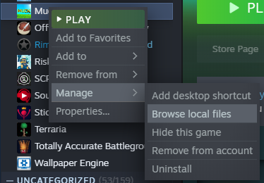
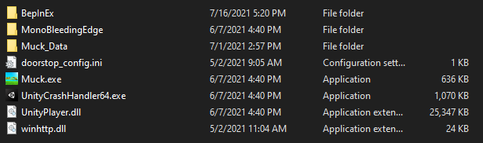
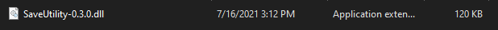

# Muck-SaveUtility
Save/Load mod for Muck

## Installation

Visit: https://muck.thunderstore.io/package/BepInEx/BepInExPack_Muck/ and download the latest release.

Visit: https://muck.thunderstore.io/package/flarfo/SaveUtility/ and download the latest release.

After you finish downloading the files go to the location you downloaded them in and extract the two zip folders.

Now navigate to your Muck game directory (C:\Program Files (x86)\Steam\steamapps\common\Muck by default). You can also find this folder through steam:

Once you find your Muck directory, paste the files from inside of the BepInExPack_Muck folder into this directory. It should now look like this:

Open the Bepinex/plugins folder and paste the SaveUtility.dll file that you downloaded earlier:

The mod is successfully installed! You can now run Muck and get to saving your games!
